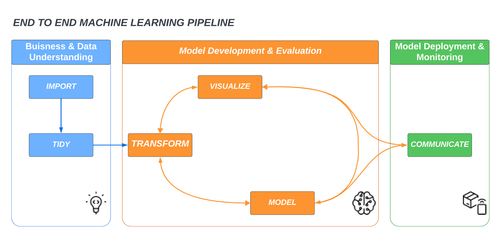

## End to End Machine Learning Pipeline

The purpose of this repo is to provide a machine learning template for classification problems.  The files in the `src` folder aid in the ingestion, transformation, modeling, and deployment of machine learning models.    



This template is built on the data science framework purposed by Hadley Wickham in R for Data Science. [[1]](#1)  The template guides the machine learning engineer through the different stages of the pipeline.  

| Stage                            | Components                                             | Outputs                                                     |
|----------------------------------|--------------------------------------------------------|-------------------------------------------------------------|
| Business and Data Understanding  | Data Ingestion<br>Exploratory Data Analysis            | Data Quality Report<br>Data Quality Test<br>Clean Dataset   |
| Model Development and Evaluation | Data Transformation<br>Model Selection<br>Model Tuning | Train/Test Data Sets<br>Data Transformer File<br>Model File |
| Model Deployment and Monitoring  | Model Deployment                                       | End User Dashboard<br>Model Card<br>Logs                            |

## Business and Data Understanding
Data Ingestion
Import data from data source.  The machine learning engineer would need to update the code in the `config/params.yaml` file:

```{python}
base:
  project: NAME OF PROJECT
  random_state: 67
  target_col: COLUMN NAME OF TARGET

data_source:
  master: DATA SOURCE

data_preparation:
  train_data_path: data/raw/train/train.cs
  test_data_path: data/raw/test/test.csv
  eda_report_path:  reports/
```

The data source is the location of where the data is located.  Currently, this is set to pull a `.csv` file, but can be updated to pull in data from a database.  The `data_preparation` portion of the code is the location of where the outputs of this stage are going to be stored.

EDA will be automatically conducted use the `Evidently` package.  It will run two reports, Data Quality Report and data quality test.  The Data Quality Report will run a traditional EDA on the data and the data quality test will provided information on missing values and near constant variables.  These reports are to be used by the machine learning engineer to identify problematic features and solutions on how to deal with the identified features.  

## Model Development and Evaluation

Data Transformation
The data needs to be transformed in order to be modeled.  The base data transformation is imputation for missing values, creation of dummy variables for categorical variables, and centering and scaling of numerical/interger values.  The code for these transformations can be found in `src/components/data_transformation.py`.  Depending of the data being modeled, this may need to be updated.  

```{python}
def get_data_transformer_object(self, train_data):
'''
This function is responsible for data trnasformation
        
'''
  try:
      numeric_features = train_data.select_dtypes(exclude = 'object').columns
      categorical_features = train_data.select_dtypes(include = 'object').columns

      num_pipeline= Pipeline(steps=[
                ("imputer",SimpleImputer(strategy="median")),
                ("scaler",StandardScaler())
                ]
            )

      cat_pipeline=Pipeline(steps=[
                ("one_hot_encoder",OneHotEncoder(handle_unknown="ignore"))
                ]
            )

      logging.info(f"Categorical columns: {categorical_features}")
      logging.info(f"Numerical columns: {numeric_features}")

      preprocessor=ColumnTransformer([
                ("num_pipeline",num_pipeline, selector(dtype_exclude="object")),
                ("cat_pipelines",cat_pipeline, selector(dtype_include="object"))
                ]
            )
            return preprocessor
```

Model Selection
Model are selected based on their accruarcy in this template.  The evaluation of models are based on a startified k-fold cross validation.  This technique is used to ensure the proportion of the target is maintained for each evaulation.  The accuracy of each model is tested on a hold out set, data which was not used in the modeling process.  The code for the model selection can be found in two files, `src/utils.py` and `src/components/model_trainer.py`.

Models `src/components/model_trainer.py`
```{python}
def initiate_model_trainer(self,train_array,test_array):
        try:
            logging.info("Split training and test input data")
            X_train,y_train,X_test,y_test=(
                train_array[:,:-1],
                train_array[:,-1],
                test_array[:,:-1],
                test_array[:,-1]
            )
            models = {
                'Baseline': 0,
                'Logistic Regression': LogisticRegression(max_iter = 1000),
                'Support Vector Machines': LinearSVC(dual='auto'),
                'Decision Trees': DecisionTreeClassifier(),
                'Random Forest': RandomForestClassifier(),
                'Naive Bayes': GaussianNB(),
                'K-Nearest Neighbor': KNeighborsClassifier(),
                'xgboost': xgb.XGBClassifier(objective="binary:logistic", random_state=42)
            }


            all_models_results, best_model_stats, best_model = evaluate_models(X_train, y_train, models, X_test, y_test)
            
            ## To get best model score from dict
            pretty_all_models = json.dumps(all_models_results, indent=4)
            pretty_best_model = json.dumps(best_model_stats, indent=4)

            print(pretty_all_models)
            print(pretty_best_model)

            save_object(
                file_path=self.model_trainer_config.trained_model_file_path,
                obj=best_model
            )
```

Model evaluation `src/utils.py`
```{python}
def evaluate_models(X_train, y_train, models, X_test, y_test):
    try:
        all_models_results = {}
        best_model = None
        best_accuracy = 0

        for model_name, model in models.items():
            if model == 0:
                #baseline
                start_time = time.time()
                train_predictions = np.ones(len(y_train))
                end_time = time.time()
                training_time = end_time - start_time
                accuracy = accuracy_score(train_predictions, y_train)
                precision = precision_score(train_predictions, y_train)
                recall = recall_score(train_predictions, y_train)
                test_predictions = np.ones(len(y_test))
                test_accuracy = accuracy_score(test_predictions, y_test)
                test_precision = precision_score(test_predictions, y_test)
                test_recall = recall_score(test_predictions, y_test)
            else:
                start_time = time.time()
                cv = StratifiedKFold(n_splits=10, shuffle=True, random_state=67)
                end_time = time.time()
                training_time = end_time - start_time
                accuracy_scores = cross_val_score(model, X_train, y_train, cv = cv, scoring = 'accuracy')
                precision_scores = cross_val_score(model, X_train, y_train, cv=cv, scoring='precision')
                recall_scores = cross_val_score(model, X_train, y_train, cv=cv, scoring='recall')

                accuracy = accuracy_scores.mean()
                precision = precision_scores.mean()
                recall = recall_scores.mean()

                # Fit the model to the entire training set
                model.fit(X_train, y_train)
                predictions = model.predict(X_test)
                test_accuracy = accuracy_score(predictions, y_test)
                test_precision = precision_score(predictions, y_test)
                test_recall = recall_score(predictions, y_test)
                print(f"{model_name} with an accuracy {test_accuracy} in {training_time} seconds")
                logging.info(f"{model_name} with an accuracy {test_accuracy} in {training_time} seconds")

            all_models_results[model_name] = {
                "model_name": model_name,
                "accuracy": accuracy,
                "precision": precision,
                "recall": recall,
                "test_accuracy": test_accuracy,
                "test_precision": test_precision,
                "test_recall": test_recall,
                "training_time": training_time
            }

            if test_accuracy > best_accuracy:
                best_accuracy = test_accuracy
                best_model = model
                best_model_stats = {
                    "name": model_name,
                    "accuracy": accuracy,
                    "precision": precision,
                    "recall": recall,
                    "test_accuracy": test_accuracy,
                    "test_precision": test_precision,
                    "test_recall": test_recall,
                    "training_time": training_time
                }
            
        return all_models_results, best_model_stats, best_model
```


## Model Deployment and Monitoring 
Model deployments uses the data transformer file and best model file to be used in creating predictions in production.  The `src/components/pipeline/predict_pipeline.py` file takes input data in the form of a `.csv` and will generate predictions on the target variable.  

```{python}
def predict(self,data):
        try:
            print('loading model and preprocessor')
            model_path=os.path.join("artifacts","model.pkl")
            preprocessor_path=os.path.join('artifacts','proprocessor.pkl')
            print("Before Loading")
            model=load_object(file_path=model_path)
            preprocessor=load_object(file_path=preprocessor_path)
            print("After Loading")
            data_scaled=preprocessor.transform(data)
            preds=model.predict(data_scaled)
            probs =model.predict_proba(data_scaled)

            return preds, probs
```

### Communication
- Examples of [Data Quality Report, Data Test, and Model Card](https://rjw-data-poc-early-warning.streamlit.app)
- Logs

```
[ 2023-11-04 13:56:31,224 ] 80 root - INFO - Entered the data ingestion method or component
[ 2023-11-04 13:56:31,291 ] 84 root - INFO - Read the data set as dataframe
[ 2023-11-04 13:56:31,291 ] 87 root - INFO - Removed spaces and characters from column names
[ 2023-11-04 13:56:31,291 ] 91 root - INFO - creating data quality report
[ 2023-11-04 13:56:50,674 ] 98 root - INFO - creating data quality tests
[ 2023-11-04 13:57:09,374 ] 110 root - INFO - train test split initiated
[ 2023-11-04 13:57:09,744 ] 116 root - INFO - train test split completed
[ 2023-11-04 13:57:09,748 ] 67 root - INFO - Read train and test data started
[ 2023-11-04 13:57:09,837 ] 71 root - INFO - Read train and test data completed data/raw/train/train.csv
[ 2023-11-04 13:57:09,837 ] 73 root - INFO - Extract input and target features started
[ 2023-11-04 13:57:09,840 ] 82 root - INFO - Extract input and target features completed
[ 2023-11-04 13:57:09,840 ] 84 root - INFO - Obtaining preprocessing object
[ 2023-11-04 13:57:09,847 ] 49 root - INFO - Categorical columns: Index(['male', 'race_ethnicity', 'frpl', 'iep', 'ell', 'ever_alternative','ap_ever_take_class'],dtype='object')
[ 2023-11-04 13:57:09,847 ] 50 root - INFO - Numerical columns: Index(['math_ss', 'read_ss', 'pct_days_absent', 'gpa', 'scale_score_11_eng','scale_score_11_math', 'scale_score_11_read', 'scale_score_11_comp'],dtype='object')
[ 2023-11-04 13:57:09,847 ] 87 root - INFO - Applying preprocessing object on training dataframe and testing dataframe.
[ 2023-11-04 13:57:09,983 ] 99 root - INFO - Saved preprocessing object.
[ 2023-11-04 13:57:09,995 ] 35 root - INFO - Split training and test input data
[ 2023-11-04 13:57:22,958 ] 79 root - INFO - Logistic Regression with an accuracy 0.8556048729813958 0.0005025863647460938 seconds
[ 2023-11-04 13:57:28,624 ] 79 root - INFO - Support Vector Machines with an accuracy 0.8534328076305601 in 0.0 seconds
[ 2023-11-04 13:57:47,681 ] 79 root - INFO - Decision Trees with an accuracy 0.8451222967230144 in 0.0 seconds
[ 2023-11-04 14:02:40,161 ] 79 root - INFO - Random Forest with an accuracy 0.9050901879308717 in 0.0 seconds
[ 2023-11-04 14:02:41,448 ] 79 root - INFO - Naive Bayes with an accuracy 0.7476626688072529 in 0.0 seconds
[ 2023-11-04 14:02:52,333 ] 79 root - INFO - K-Nearest Neighbor with an accuracy 0.8725092076683351 in 0.0 seconds
[ 2023-11-04 14:03:35,291 ] 79 root - INFO - xgboost with an accuracy 0.9060345641703654 in 0.0 seconds
```

## References
<a id="1">[1]</a> 
Wickham, H., & Grolemund, G. (2016). R for data science: Import, tidy, transform, visualize, and model data, (1st ed., ). Sebastopol: O’Reilly.
